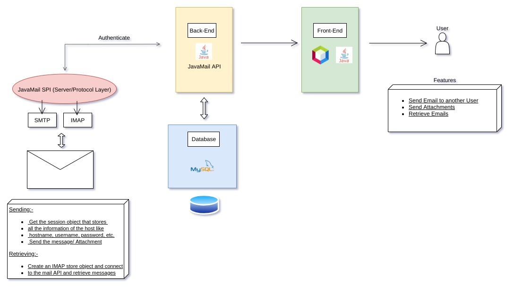

# MailScape

## About the project:

MailScape is an email client build in Java. It is a full stack project which makes use of JavaMail API for sending and receiving mails, Java Swing for the GUI and MySQL database for starring emails.

## Project Architecture:

## Tech stacks used:

- Java
- JavaMail API
- Java Swing
- MySQL

## Aim:

- To send mails to multiple recipients with attachment.
- To view received mails.
- To star emails for future reference.